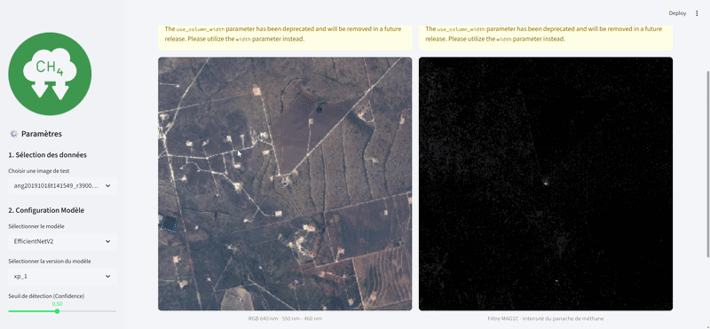

# methane-detection-starcop
[](https://deepwiki.com/mathischmp/methane-detection-starcop)

This project leverages computer vision and hyperspectral satellite imagery to automate the detection of methane plumes. By processing raw spectral data from the STARCOP dataset, it transforms complex information into actionable insights for climate monitoring and environmental protection.

The core of the project is a U-Net-based segmentation model with an pre-trained backbone, trained to identify methane plume masks from 4-channel satellite images (RGB + a specialized `mag1c` filter). The repository includes a full pipeline for data handling, training, and evaluation, as well as an interactive Streamlit application for visual analysis of model predictions.

<p align="center">
  
</p>


## Key Features

*   **Advanced Segmentation Model**: Utilizes a U-Net architecture with a pre-trained encoder for high-accuracy methane plume segmentation.
*   **End-to-End MLOps Pipeline**: A complete workflow from data downloading and preprocessing to stratified cross-validated training and model evaluation.
*   **Multi-Channel Data Fusion**: Combines visible spectrum RGB data with a `mag1c` methane-sensitive band to improve detection accuracy.
*   **Interactive Analytics Dashboard**: A Streamlit application to run inference on test data, adjust detection thresholds, and visualize model performance with color-coded overlays (True Positives, False Positives, False Negatives).
*   **Experiment Management**: Features a custom logger to track metrics, save model checkpoints, and generate performance reports for each cross-validation fold.
*   **Data Augmentation**: Employs `albumentations` for robust data augmentation, enhancing model generalization.

## Technology Stack

*   **ML/DL**: PyTorch, Segmentation Models Pytorch, Albumentations
*   **Geospatial**: Rasterio
*   **Web App**: Streamlit
*   **Data Handling**: Pandas, NumPy
*   **Configuration**: YAML

## Project Structure

```
.
├── app/                  # Source code for the Streamlit web application
│   ├── main.py           # Main entry point for the Streamlit app
│   ├── assets/           # Images and logos for the UI
│   ├── data_utils.py     # Functions for loading and preprocessing data for the app
│   └── ui_utils.py       # UI helper functions (e.g., plotting)
├── methan_detection/     # Core Python package for the project
│   ├── pipeline.py       # End-to-end pipeline for data download, processing, and training
│   ├── trainer.py        # Handles the model training and validation loop logic
│   ├── models.py         # Defines segmentation models (U-Net, EfficientNetV2)
│   ├── dataset.py        # PyTorch Dataset class for data loading
│   ├── config.yaml       # Configuration file for all training parameters
│   ├── dice_loss.py      # Custom loss functions for segmentation
│   ├── methaneLogger.py  # Custom logger for experiment tracking
│   ├── modelTester.py    # Class for evaluating trained models on the test set
│   └── ...
├── notebooks/            # Jupyter notebooks for exploration and demonstration
│   ├── data_exploration.ipynb
│   └── methane_detection.ipynb
├── .streamlit/           # Streamlit configuration
├── setup.py              # Setup script for installing the local package
└── README.md             # This file
```

## Getting Started

### Prerequisites

*   Python 3.8+
*   Git

### Installation

1.  **Clone the repository:**
    ```bash
    git clone https://github.com/mathischmp/methane-detection-starcop.git
    cd methane-detection-starcop
    ```

2.  **Install the package and dependencies:**
    This project uses a `setup.py` file. Installing it in editable mode along with other key dependencies is recommended.
    ```bash
    pip install -e .
    pip install segmentation-models-pytorch streamlit gdown
    ```

### Usage

The project is structured into distinct workflows for training, evaluation, and interactive analysis.

#### 1. Training the Model

The training process is managed by the `Pipeline` class, which handles data downloading, preprocessing, and model training based on the settings in `methan_detection/config.yaml`.

To start the training run for the "easy" dataset subset:

```python
# In a Python script or notebook
from methan_detection.pipeline import Pipeline

# The pipeline automatically downloads and extracts data
pipeline = Pipeline(training_type="easy")
pipeline.run()
```
The training logs, model checkpoints, and performance graphs will be saved to the `results/` directory.

#### 2. Evaluating the Model

After training, you can evaluate the ensemble performance of the cross-validated models on the test set using the `ModelTester`.

```python
# In a Python script or notebook
from methan_detection.modelTester import ModelTester

# Specify the model name and experiment number from the training run
tester = ModelTester(model_name="EfficientNetV2", num_xp=1)

# Evaluate and visualize error maps for 6 random samples
tester.evaluate(n_visualize=6)
```

#### 3. Running the Interactive Dashboard

The Streamlit application provides a user-friendly interface to test the model on individual images from the test set.

1.  Make sure you have a trained model checkpoint in the `results/` directory. The path is specified in `app/main.py`.
2.  Launch the Streamlit app from the root of the repository:
    ```bash
    streamlit run app/main.py
    ```
The application allows you to:
*   Select a test image by its ID.
*   View the RGB satellite image and the `mag1c` filter input.
*   Click "Lancer la détection" to run inference.
*   Analyze the output mask and a performance overlay showing True/False Positives and Negatives.
*   Adjust the detection confidence threshold.
